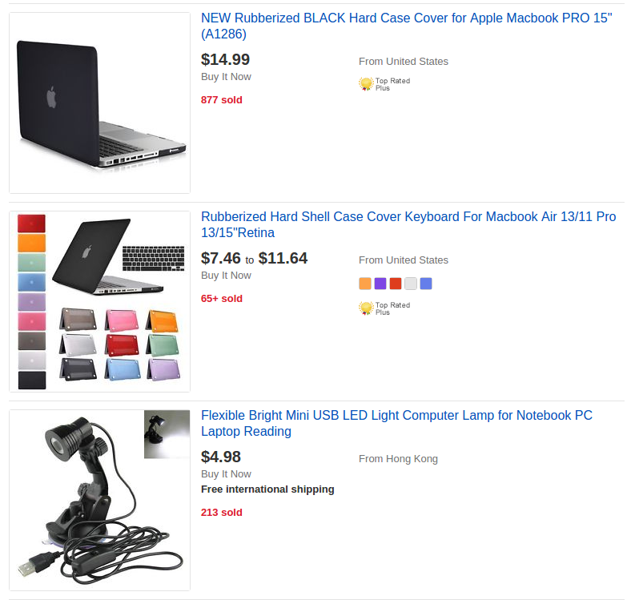
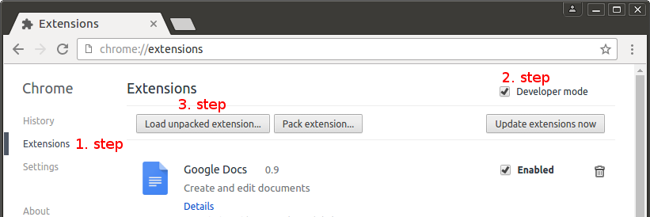

# Price rounder

## Description

A browser plugin for Google Chrome and Firefox to round up prices to next integer. This plugin neutralizes the common marketing trick of price tags. When the price is `9.99` it will show `10 [9.99]`.

## Example screenshots
* Digitec example from http://digitec.ch:

Rounded:
  

Original:

* eBay example from http://ebay.com:

Rounded:

Original:

## Usage

1.   Open Chrome
2.   Open Settings / Extension
3.   Enable `Developer mode`
4.   Select the `script` directory in `Load unpacked extension...`

### Tests

Have a look at [QUnit tests](test/test.html)

## Known issues
Every number is rounded not jut the price tags :)

## Credits

Thank you very much to James Padolsey http://james.padolsey.com for the very useful findAndReplaceDOMText function.
